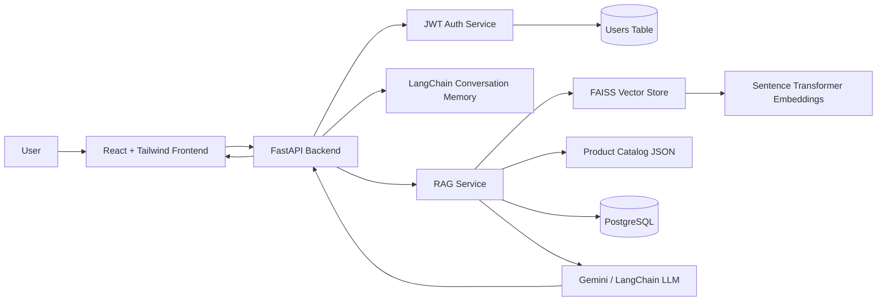
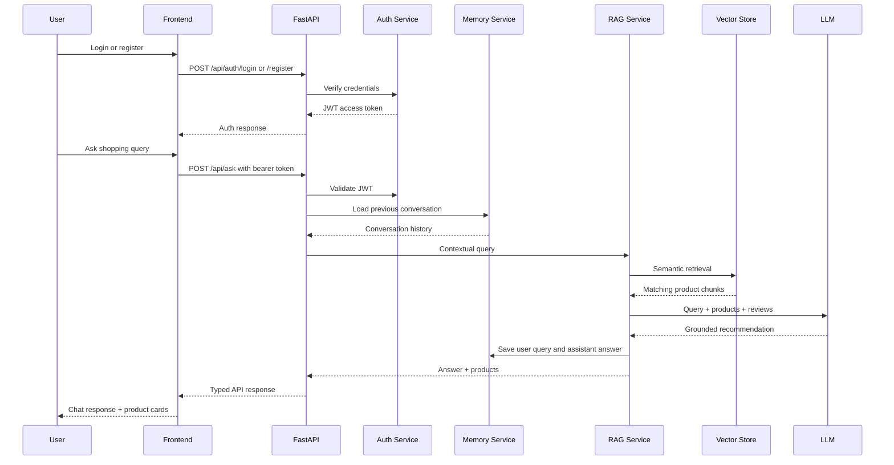
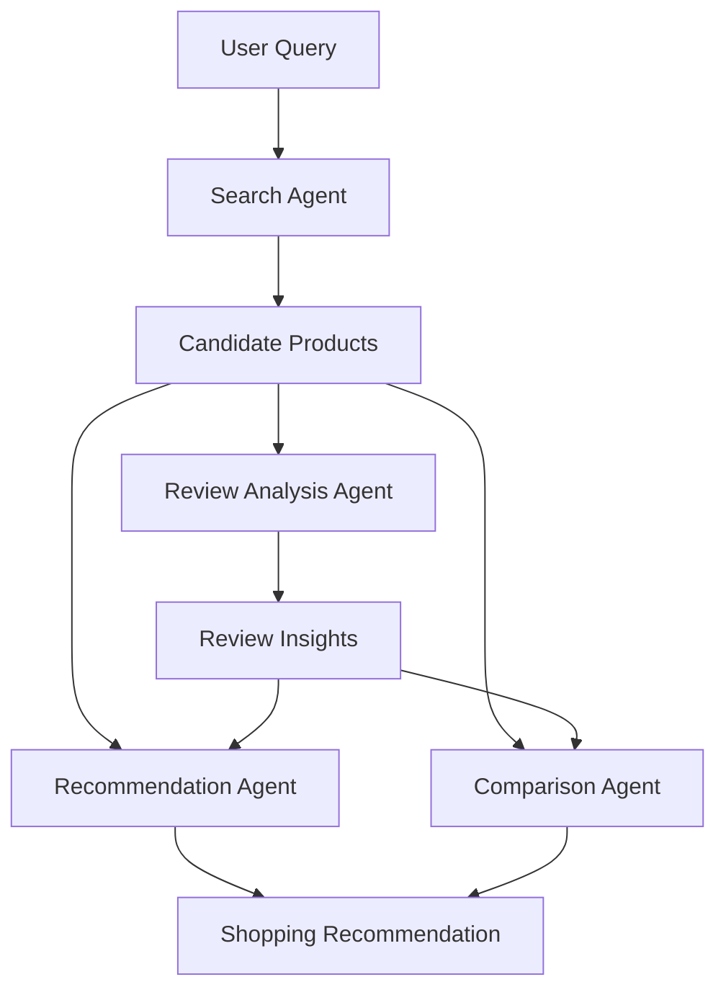

# AI Shopping Copilot

AI Shopping Copilot is a full-stack conversational shopping assistant that helps users discover products, compare options, summarize review signals, and refine recommendations across multiple turns. It combines a React chat experience with a FastAPI backend, semantic search, Retrieval-Augmented Generation, conversation memory, and a containerized PostgreSQL-backed deployment.

The project is designed to demonstrate production-minded AI application engineering: clean service boundaries, typed API responses, Dockerized infrastructure, RAG orchestration, and a UI that turns product retrieval into an interactive shopping workflow.

## Overview

Modern shoppers rarely ask perfectly scoped questions on the first try. A user may start with "Suggest laptops" and then follow up with "Only gaming ones" or "Under 70000." AI Shopping Copilot keeps conversational context, retrieves relevant products, and generates practical recommendations grounded in the product catalog.

Core goals:

- Make product discovery conversational and iterative.
- Use semantic retrieval instead of keyword-only search.
- Ground AI answers in real catalog data and customer reviews.
- Keep the frontend fast, responsive, and recruiter-demo friendly.
- Package the full stack with Docker Compose for repeatable local runs.

## Features

- Conversational product search with multi-turn memory.
- JWT-based authentication with register, login, and protected assistant endpoints.
- RAG-powered answers using retrieved product context.
- Product recommendation cards with price, brand, rating, description, and action buttons.
- Semantic product retrieval with embeddings and FAISS.
- Keyword fallback search for resilience.
- PostgreSQL integration for product persistence.
- Gemini/LangChain-based generation when API credentials are configured.
- Graceful fallback responses when an LLM key is not available.
- Responsive React + Tailwind interface.
- Docker Compose stack for frontend, backend, and Postgres.

## Architecture



### Request Flow



## Tech Stack

| Layer | Technology |
| --- | --- |
| Frontend | React, Vite, TypeScript, Tailwind CSS |
| Backend | FastAPI, Pydantic, Uvicorn |
| AI Orchestration | LangChain, Gemini |
| Retrieval | FAISS, sentence-transformers |
| Memory | LangChain `ConversationBufferMemory` |
| Authentication | JWT, Passlib bcrypt, python-jose |
| Database | PostgreSQL, SQLAlchemy async, asyncpg |
| API Client | Axios |
| Deployment | Docker, Docker Compose, Nginx |

## RAG Workflow

The backend uses Retrieval-Augmented Generation to keep answers grounded in catalog data.

1. The user registers or logs in and receives a JWT access token.
2. The frontend sends a user query, session id, and bearer token to `/api/ask`.
3. FastAPI validates the JWT and resolves the current user.
4. The memory service loads prior turns and builds a contextual query for follow-up requests.
5. The RAG service searches the FAISS vector index for semantically relevant product chunks.
6. Retrieved documents are mapped back to product records.
7. If semantic retrieval returns no matches, the product service performs fallback keyword search.
8. Product descriptions, specifications, reviews, prices, and ratings are assembled into context.
9. The LLM generates a concise shopping recommendation grounded in the retrieved products.
10. The final turn is saved back into conversation memory.

This allows follow-ups like:

```text
User: Suggest laptops
User: Only gaming ones
```

The second query can be interpreted as "gaming laptops" because the memory service supplies the prior shopping context.

## Multi-Agent Architecture

The backend includes an agent-oriented orchestration layer that separates product reasoning into focused responsibilities:



Agent roles:

- Search Agent: combines semantic and keyword search to identify candidate products.
- Review Analysis Agent: summarizes review themes and customer sentiment.
- Recommendation Agent: ranks products based on query intent, price, rating, and context.
- Comparison Agent: explains tradeoffs when the user asks to compare products.

This structure keeps retrieval, review understanding, recommendation logic, and comparison reasoning independently testable and easier to extend.

## Folder Structure

```text
AI Shopping Copilot/
├── backend/
│   ├── app.py
│   ├── Dockerfile
│   ├── requirements.txt
│   ├── data/
│   │   └── products.json
│   ├── models/
│   │   ├── auth.py
│   │   ├── db.py
│   │   ├── product.py
│   │   └── response.py
│   ├── routes/
│   │   ├── auth.py
│   │   └── ask.py
│   ├── services/
│   │   ├── auth_service.py
│   │   ├── ai_service.py
│   │   ├── db_service.py
│   │   ├── llm.py
│   │   ├── memory.py
│   │   ├── orchestrator.py
│   │   ├── products_service.py
│   │   ├── rag.py
│   │   ├── recommender.py
│   │   └── vector_service.py
│   └── vectorstore/
│       ├── build_index.py
│       └── embed.py
├── frontend/
│   ├── Dockerfile
│   ├── nginx.conf
│   ├── package.json
│   └── src/
│       ├── components/
│       ├── hooks/
│       ├── pages/
│       ├── services/
│       └── types.ts
├── docker-compose.yml
├── .env.example
└── README.md
```

## Setup

### Prerequisites

- Docker Desktop
- Node.js 20+ for local frontend development
- Python 3.11+ for local backend development
- Gemini API key for LLM responses

### Docker Setup

Copy the sample environment file:

```bash
copy .env.example .env
```

Set your API keys in `.env`:

```env
GEMINI_API_KEY=your_gemini_api_key
GEMINI_MODEL=gemini-pro
HUGGINGFACE_API_KEY=your_huggingface_key
JWT_SECRET_KEY=replace_with_a_long_random_secret
JWT_ALGORITHM=HS256
JWT_ACCESS_TOKEN_EXPIRE_MINUTES=1440
VITE_API_BASE_URL=http://localhost:8000/api
```

Start the full stack:

```bash
docker compose up --build
```

Open the app:

```text
http://localhost:4173
```

Backend API:

```text
http://localhost:8000/api/ask
```

Authentication endpoints:

```text
POST http://localhost:8000/api/auth/register
POST http://localhost:8000/api/auth/login
GET  http://localhost:8000/api/auth/me
```

PostgreSQL:

```text
localhost:5432
```

### Local Development

Backend:

```bash
cd backend
python -m venv .venv
.venv\Scripts\activate
pip install -r requirements.txt
uvicorn app:app --reload --host 0.0.0.0 --port 8000
```

Frontend:

```bash
cd frontend
npm install
npm run dev
```

## Screenshots

Add screenshots here before sharing the project with recruiters.

### Chat + Recommendations

```text
docs/screenshots/chat-recommendations.png
```

### Product Cards

```text
docs/screenshots/product-cards.png
```

### Multi-Turn Query Memory

```text
docs/screenshots/chat-memory.png
```

Suggested demo prompts:

- "Best laptop under 70000"
- "Only gaming ones"
- "Compare the top two"
- "Which has better reviews?"

## Future Work

- Add authenticated user profiles and persistent chat memory.
- Store conversation history in Postgres or Redis instead of process memory.
- Add product detail pages and comparison tables.
- Add filters for price, category, rating, and brand.
- Add streaming LLM responses for a faster chat experience.
- Add automated backend tests for RAG and memory behavior.
- Add frontend component tests for chat and product cards.
- Add observability with structured logs, request tracing, and latency metrics.
- Add vector index refresh jobs when the catalog changes.
- Deploy to a cloud environment with managed Postgres and container hosting.

## Why This Project Matters

AI Shopping Copilot demonstrates the core skills needed for modern AI product engineering: building usable interfaces, grounding LLM output with retrieval, managing conversational context, designing service boundaries, and packaging the system so another engineer can run it quickly.
